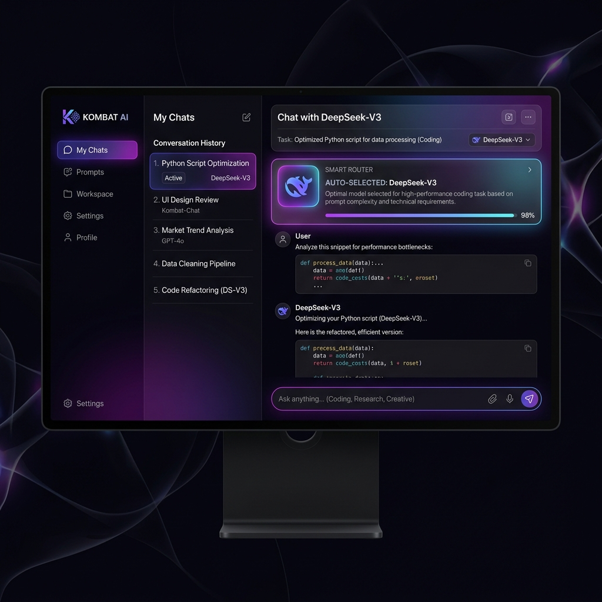

# Kombat AI ✦

**One Platform. Every AI Model.**

Kombat AI is a premium, all-in-one AI platform that connects you to the latest and greatest language models (GPT-4o, Claude 3.5 Sonnet, Gemini 1.5 Pro, DeepSeek-V3, Mistral, and Llama). Instead of paying for multiple subscriptions, Kombat AI brings them all into a single, unified interface.



## ✨ Core Features

### 🧠 Smart Router (Auto-Select Models)
Not sure which model is best for your task? Just select **Auto**, and our intelligent Smart Router will analyze your prompt and instantly route it to the optimal model based on:
- **Task Type:** (e.g., DeepSeek-V3 for Coding, Claude Sonnet for Creative Writing, Gemini Pro for Data Analysis).
- **Cost Efficiency:** Automatically falls back to cheaper, faster models (like GPT-4o-Mini) for simple general queries.

### ⚔️ Battle Mode
Compare AI models head-to-head. Send a single prompt and watch 3 different models stream their responses side-by-side simultaneously. Track their speed, cost, and vote on the best answer.

### 💰 Cost Dashboard
Full transparency on your AI usage. The Cost Dashboard tracks every token generated, showing you exactly how much you are spending per model. Get intelligent insights on how to optimize your prompts to save money.

### 🔑 Bring Your Own Key (BYOK)
Built-in support for your own API keys. Add your OpenAI, Anthropic, and Google Gemini API keys locally to the platform. Your keys are securely stored in the database and never shared.

## 🚀 Tech Stack

- **Frontend:** HTML5, CSS3 (Vanilla, CSS Grid/Flexbox), JavaScript (Vanilla)
- **Backend:** Node.js, Express 5.0
- **Database:** Turso (Cloud SQLite via `@libsql/client`)
- **Payments:** Stripe Checkout
- **Hosting:** Vercel (Serverless Functions)
- **Streaming:** Server-Sent Events (SSE) for real-time AI token streaming

## 💻 Local Development

1. **Clone the repository**
   ```bash
   git clone https://github.com/gasingh80/NexusAI.git
   cd NexusAI
   ```

2. **Install dependencies**
   ```bash
   npm install
   ```

3. **Configure Environment Variables**
   Create a `.env` file in the root directory:
   ```env
   TURSO_DATABASE_URL=libsql://your-turso-db.turso.io
   TURSO_AUTH_TOKEN=your-turso-auth-token
   STRIPE_SECRET_KEY=sk_test_...
   ```
   *(Note: For local development, if Turso vars are omitted, it will gracefully fallback to a local SQLite file named `nexus.db`)*

4. **Start the server**
   ```bash
   npm start
   ```
   The app will run at `http://localhost:3000`.

## 🌐 Deployment

This project is fully configured for Vercel. 
Simply import the project into Vercel, add your environment variables (`TURSO_DATABASE_URL`, `TURSO_AUTH_TOKEN`, `STRIPE_SECRET_KEY`), and deploy!

---
*Made with ❤️ for AI Enthusiasts.*
